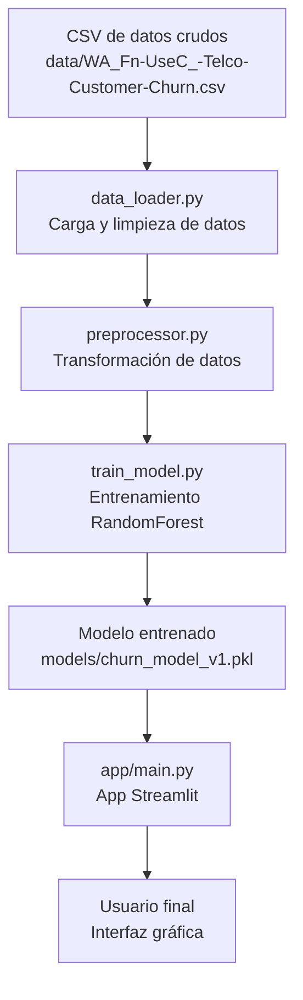

## Justificación de hiperparámetros del modelo

Para abordar el desbalance de clases presente en el problema de churn, se utilizó el hiperparámetro `class_weight='balanced'` en el RandomForestClassifier. Esto ajusta automáticamente el peso de cada clase en función de su frecuencia, permitiendo que el modelo preste más atención a la clase minoritaria y evitando que se sesgue hacia la clase mayoritaria. Además, se estableció `min_samples_leaf=5` para asegurar que cada hoja del árbol tenga al menos 5 muestras, lo que ayuda a reducir el riesgo de overfitting al evitar que el modelo cree ramas demasiado específicas para pocos datos. Estas decisiones contribuyen a un modelo más robusto y generalizable, especialmente en contextos con datos desbalanceados.

## Transformaciones de Preprocesamiento de Datos

- **Variables numéricas** (`tenure`, `MonthlyCharges`, `TotalCharges`):
  - Se rellenan los valores faltantes usando la mediana de cada columna.
  - Se escalan los valores para que tengan media 0 y desviación estándar 1 (normalización estándar).

- **Variables categóricas** (como `gender`, `Partner`, `InternetService`, etc.):
  - Se rellenan los valores faltantes con la palabra "missing".
  - Se convierten en variables dummy mediante One-Hot Encoding, permitiendo nuevos valores desconocidos en producción.

- Cualquier columna no listada como numérica o categórica se elimina del conjunto de datos durante el preprocesamiento.

## Flujo de datos del proyecto



## Estructura y descripción de archivos principales

- **data_loader.py**: Carga el archivo CSV, limpia los datos (por ejemplo, convierte 'TotalCharges' a numérico y elimina 'customerID').
- **preprocessor.py**: Define el pipeline de transformación de datos, aplicando imputación y escalado a variables numéricas, y one-hot encoding a categóricas.
- **train_model.py**: Orquesta el flujo de entrenamiento: carga datos, preprocesa, entrena el modelo RandomForest, evalúa y guarda el pipeline completo como .pkl.
- **models/**: Carpeta donde se almacena el modelo entrenado (`churn_model_v1.pkl`).
- **app/main.py**: App principal de Streamlit. Carga el modelo .pkl y lanza la interfaz gráfica para predicción.
- **app/ui/main_window.py**: Define la interfaz de usuario de la app, mostrando formularios y resultados de predicción.
- **notebooks/eda_analysis.ipynb**: Análisis exploratorio de datos (EDA) y visualizaciones previas al modelado.
- **requirements.txt**: Lista de dependencias necesarias para reproducir el entorno.
- **Dockerfile y compose.yaml**: Permiten la construcción y despliegue del proyecto en contenedores Docker.

## Ejecución rápida

1. Entrena el modelo (si no existe):
	```bash
	python -m src.train_model
	```
2. Lanza la app de predicción:
	```bash
	streamlit run app/main.py
	```
3. Alternativamente, puedes usar Docker Compose:
	```bash
	docker compose up --build
	```

## Notas adicionales

- El modelo y el pipeline completo se guardan en `models/churn_model_v1.pkl` para facilitar su reutilización y despliegue.
- La app de Streamlit verifica automáticamente la existencia del modelo y muestra instrucciones si no está entrenado.
- El código está modularizado para facilitar el mantenimiento y la extensión del flujo de trabajo.
 